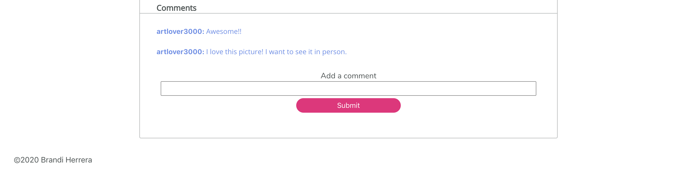
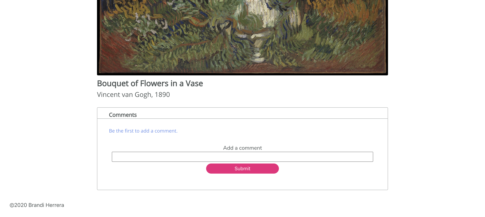

# MUSEME Server

This application allows users to view randomized art from The Metropolitan Museum of Art Collection in New York City. Users can save art to their own curated gallery which they can view at any time, and users can comment along with other art aficionados.

## Working Prototype
[MUSEME API Repo](https://github.com/brandiherrera/museum-app-full-stack-capstone-server)

[MUSEME React Repo](https://github.com/brandiherrera/museum-app-full-stack-capstone-react)

[Live app](https://museum-app-full-stack-capstone-react.brandiherrera.now.sh/)

<!-- [Live MUSEME Application]() -->

## Site Map: MVP


## User Stories

**Landing Page**

As a new user I want to understand the purpose of the app so I can decide if I want to sign up.

**Sign Up Page**

As a new user I want to sign up for the app so I can use it to view random artwork, save to my own gallery if I wish, and comment on pieces and discuss the artwork with other users.

**Log In Page**

As a returning user I want to log in so I can have access to random art, my saved gallery, and other users' thoughts and comments on various artwork.

**Dashboard**

As a returning user I want to view a randomly generated piece of art in addition to comments from other users. I also want to save the art to my gallery if I wish, so I can view it at a later time.

**Gallery**

As a returning user I want to view my gallery so I can enjoy artwork that I like at my leisure.

**Art Page**

As a returning user I want to view artwork that I have saved in greater detail at my leisure so I can enjoy it, view other comments, and add comments of my own.

**Comments**

As a returning user I want to post comments on various pieces of art so I can enter discussions with other users or simply to share my thoughts with myself and other users. I want to be able to view them in real-time and at a later date as I wish.

**Log Out Page**

As a returning user I want to access a log out so I can log out at my convenience.

## Live Screenshots

### **Landing Page**


### **Sign Up Page**

#### POST `api/users`


### **Log In Page**

#### POST `api/auth/login`


### **Dashboard**

#### GET `api/art` <br> 
<!-- ----------------TODO: RANDOM GENERATOR HERE? ---------------- -->




### **Gallery**

#### GET `api/art/gallery/:user_id/:object_id` <br> 
<!-- ----------------TODO: DELETE HERE? ---------------- -->


### **Art Page**

#### GET `api/art/:object_id`




### **Comments**

#### POST `api/art/comments` <br> GET `api/art/comments/:object_id`


## API Documentation

### Users Endpoints
*Private endpoints containing `/:user_id` require an `authorization` header with value of `bearer YOUR_AUTH_TOKEN_HERE` which is assigned upon signing up for an account.*

### POST `api/users`

Adds a new user to the user database which enables them to use their account to view art, save art, and comment on art along with other users. 

### POST `api/auth/login`

Allows a user in the database to "login" with their correct credentials. Returns the authToken and userId which allows them access to their private information on the secure `/users/:user_id` endpoint.

Once the user is logged in, the server is updated with a random art image through various back end algorithms and fetches, which it subsequently displays on the user dashboard.

### GET `api/met/daily`

Returns the art that is to be displayed on the user's dashboard, through a sequence of events on the server after login which ensures a random piece of art is generated.

**Example response**
```JSON
{
    "daily_interval_id": 197,
    "id": 37,
    "date_created": "2020-02-09T13:30:12.355Z",
    "object_id": 436525,
    "primary_image": "https://images.metmuseum.org/CRDImages/ep/original/DT7098.jpg",
    "art_title": "Bouquet of Flowers in a Vase",
    "art_artist": "Vincent van Gogh",
    "art_date": "1890"
}
```

### GET `api/art/gallery/:user_id`

Allows a logged-in user to access all of the artwork they have saved to their gallery by returning an array of just the image data. The user can click on each individual image to then proceed to the art page where the user can then view each artwork in greater detail and comment.

**Example response**
```JSON
[
    {
        "id": 43,
        "date_created": "2020-02-09T13:30:12.355Z",
        "user_id": 1,
        "user_name": "iLOVEart",
        "art_id": 436532,
        "object_id": 436532,
        "primary_image": "https://images.metmuseum.org/CRDImages/ep/original/DT1502_cropped2.jpg",
        "art_title": "Self-Portrait with a Straw Hat (obverse: The Potato Peeler)",
        "art_artist": "Vincent van Gogh",
        "art_date": "1887"
    },
    {
        "id": 41,
        "date_created": "2020-02-09T13:30:12.355Z",
        "user_id": 1,
        "user_name": "iLOVEart",
        "art_id": 436530,
        "object_id": 436530,
        "primary_image": "https://images.metmuseum.org/CRDImages/ep/original/DT1494.jpg",
        "art_title": "Oleanders",
        "art_artist": "Vincent van Gogh",
        "art_date": "1888"
    }
]
```

### POST `api/gallery/:user_id`

Allows a logged-in user to save an artwork with all corresponding data and comments.

**Example request**
```JSON
{
	"art_id": 436530
}
```

A successful request responds with `201 Created`.


### POST `api/comments/`

Allows a logged-in user to post a comment on a piece of art.

**Example request**
```JSON
    {
        "user_name": "iLOVEart",
        "art_id": 436530,
        "comment": "Awesome!!"
    }
```
A successful request responds with `201 Created`.

### GET `api/comments/object_id`

Allows a logged-in user to view all comments other users have made on a piece of art as well as their own comments. This displays below each piece of art and is referenced by the artwork's `object_id`.

**Example response**
```JSON
[
    {
        "id": 58,
        "date_created": "2020-02-17T01:43:53.194Z",
        "user_id": 1,
        "user_name": "iLOVEart",
        "art_id": 436530,
        "comment": "Awesome!!"
    },
    {
        "id": 59,
        "date_created": "2020-02-17T01:45:53.195Z",
        "user_id": 2,
        "user_name": "artlover3000",
        "art_id": 436530,
        "comment": "I think this is awesome, too! @iLOVEart"
    }
]
```

## Third-Party API Documentation

Database information is sourced from [The Metropolitan Museum of Art Collection API](https://metmuseum.github.io/). Sourced information is fetched from this third-party API and kept in a PostgreSQL database that is updated automatically when `GET api/met` is called.

## Technology Used

<b>Front End</b>
* HTML5
* CSS3
* JavaScript
* React
* Jest and Enzyme for testing
  
<b>Back End</b>
* Node.js
* Express.js
* PostgreSQL
* Mocha and Chai for testing

## Scripts

Install node modules `npm install`

Run the tests `npm test`

Start the application `npm start`

Start nodemon for the application `npm run dev`